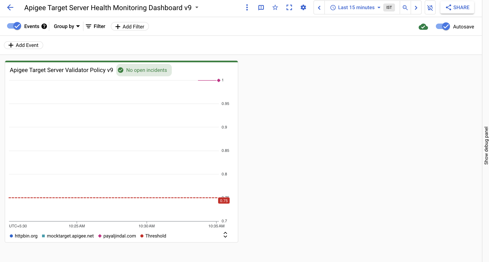

# Apigee Target Server Validator

The objective of this tool to validate targets in Target Servers & Apigee API Proxy Bundles exported from Apigee.
Validation is done by deploying a sample proxy which check if HOST & PORT is open from Apigee.

> **NOTE**: Discovery of Targets in API Proxy & Sharedflows is limited to only parsing URL from `TargetEndpoint` & `ServiceCallout` Policy.

> **NOTE**: Dynamic targets are **NOT** supported, Ex : `https://host.{request.formparam.region}.example.com}`

## Pre-Requisites
* Python3.x
* Java
* Maven
3.9.6
* Please install the required Python dependencies
```
    python3 -m pip install -r requirements.txt
```
* Please build the java callout jar by running the below command

```
bash callout/build_java_callout.sh
```

* Please fill in `input.properties`

```
[source]
baseurl=https://x.x.x.x/v1                       # Apigee Base URL. e.g http://management-api.apigee-opdk.corp:8080
org=xxx-xxxx-xxx-xxxxx                           # Apigee Org ID
auth_type=basic                                  # API Auth type basic | oauth

[target]
baseurl=https://apigee.googleapis.com/v1         # Apigee Base URL
org=xxx-xxxx-xxx-xxxxx                           # Apigee Org ID
auth_type=oauth                                  # API Auth type basic | oauth

[csv]
file=input.csv                                   # Path to input CSV. Note: CSV needs HOST & PORT columns
default_port=443                                 # default port if port is not provided in CSV

[validation]
check_csv=true                                   # 'true' to validate Targets in input csv
check_proxies=true                               # 'true' to validate Proxy Targets else 'false'
skip_proxy_list=mock1,stream                     # Comma separated list of proxies to skip validation;
proxy_export_dir=export                          # Export directory needed when check_proxies='true'
api_env=dev                                      # Target Environment to deploy Validation API Proxy
api_name=target_server_validator                 # Target API Name of Validation API Proxy
api_force_redeploy=false                         # set 'true' to Re-deploy Target API Proxy
api_hostname=example.apigee.com                  # Target VirtualHost or EnvGroup Domain Name
api_ip=<IP>                                      # IP address corresponding to api_hostname. Use if DNS record doesnt exist
report_format=csv                                # Report Format. Choose csv or md (defaults to md)

[gcp_metrics]
enable_gcp_metrics=true                          # set 'true' to push target server's host and status to stack driver
project_id=xxx-xxx-xxx                           # Project id of GCP project where the data will be pushed
metric_name=custom.googleapis.com/<metric_name>  # Replace <metric_name> with custom metric name
enable_dashboard=true                            # set 'true' to create the dashboard with alerting policy
dashboard_title=Apigee Target Server Monitoring Dashboard  # Monitoring Dashboard Title
alert_policy_name=Apigee Target Server Validator Policy    # Alerting Policy Name
notification_channel_id=xxxxxxxx                 # Notification Channel id

[gcs_bucket]
bucket_name=target-server-validator-gcs          # GCS bucket name for storing the --scan output
bucket_project_id=xx-xxx-xx                      # GCS bucket project id
file_path_in_bucket=scan_output.txt              # path to output file
```

To get the notification channel id, use the following command

```
gcloud beta monitoring channels list --project=<project_id>
```

This command will display all available notification channels within your project. You can select the appropriate one based on your requirements. Locate the notification channel ID under the `name` field in the format `projects/<project_id>/notificationChannels/<notification_channel_id>`, and insert it into the input.properties file.


* Sample input CSV with target servers
> **NOTE:** You need to set `check_csv=true` in the `validation` section of `input.properties`

> **NOTE:** You need to set `file=<CSV Name>` in the `csv` section of `input.properties`
> If PORT is omitted from the csv, the value of default_port will be used from `input.properties`.
```
HOST,PORT
httpbin.org
mocktarget.apigee.net,80
smtp.gmail.com,465
```


* Please run below commands to authenticate, based on the Apigee flavours you are using.

```
export APIGEE_OPDK_ACCESS_TOKEN=$(echo -n "<user>:<password>" | base64) # Access token for Apigee OPDK
export APIGEE_ACCESS_TOKEN=$(gcloud auth print-access-token)            # Access token for Apigee X/Hybrid
```

## Highlevel Working 
* Export Target Server Details
* Export Proxy Bundle 
* Parse Each Proxy Bundle for Target
* Run Validate API against each Target (optional)
* Generate csv/md Report or push data to GCP Monitoring Dashboard

## Usage

The script supports the below arguments

* `--onboard`               Toggle to onboard validator proxy, custom metric descriptors and dashboard
* `--scan`                  Toggle to read all resources
* `--monitor`               Toggle to check the status of target servers and push to GCP Logging

To onboard, run
```
python3 main.py --onboard
```

To scan, run
```
python3 main.py --scan
```

To monitor, run
```
python3 main.py --monitor
```

--onboard deploys an API proxy to validate if the target servers are reachable or not. To use the API proxy, make sure your payloads adhere to the following format:

```json
[
    {
        "host": "example.com",
        "port": 443
    },
    {
        "host": "example2.com",
        "port": 443
    },
    // Add up to 8 more host-port combinations as needed
]
```

The response will look like this - 
```json
[
    {
        "host": "example.com",
        "port": 443,
        "status" : "REACHABLE"
    },
    {
        "host": "example2.com",
        "port": 443,
        "status" : "UNKNOWN_HOST"
    },
    // and so on 
]
```

## Report
Validation Report: `report.md` OR `report.csv` can be found in the same directory as the script.

Please check a [Sample report](report.md)

## GCP Monitoring Dashboard
The script can also create a GCP Monitoring Dashboard with an alerting widget like shown below:

